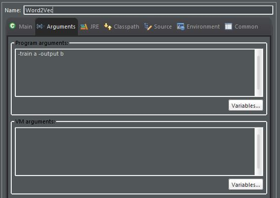

# Word2Vec In Java
* https://code.google.com/archive/p/word2vec/source/default/source
* Changed Word2vec c code to Java

## Usage
* Put "Input.txt" in the folder containing the source code
```bash
The contents of Input.txt are as follows
There is one document per line
All documents must be preprocessed
```

* Preprocessing: documents should be separated by words using morphemes
* In Eclipse, you mush give arguments 





* a = input.txt, b = output.txt...  That is, the name of the input output file.
* but, in Code I hava set it (Line 34, 35)

## Contents of "Input.txt" after preprocessing
* Document 1 : KimJunho is interested in machine learning and deep learning
* Document 2 : KimJunho is interested in recruiting professional researches
```bash
KimJunho isterested machine learning deep learning
KimJunho recruiting professional researchers
```

## Main Variable Description
* See Line 894 (public static class Builder)
```bash
1. cbow = false
   Which of the cbow and skip-gram models to learn ?
   false : use skip gram
   true : use cbow model

2. startingAlpha = 0.025F
   This is a learningrate
   The smaller the value, the more accurate the learning, but the slower the learning speed

3. window = 5
   How many words to look around when learning
   The default value is 5, meaning that you see 5 words

4. negative = 0
   It can be used to improve the efficiency of calculation speed
   Methodology has Hierarchical Softmax and Negative Sampling
   If 0, Hierarchical Softmax
   else, Negative Sampling.. default value 5~10

5. minCount = 5
   Meaning that I will only see words from at least a few words in the document
   If you want to learn every word, minCount = 0

6. layerOneSize = 200
   Mean dimension of word vector
   default value is 200
   The higher the dimension, the more precise it is, but the learning speed is slower
```
